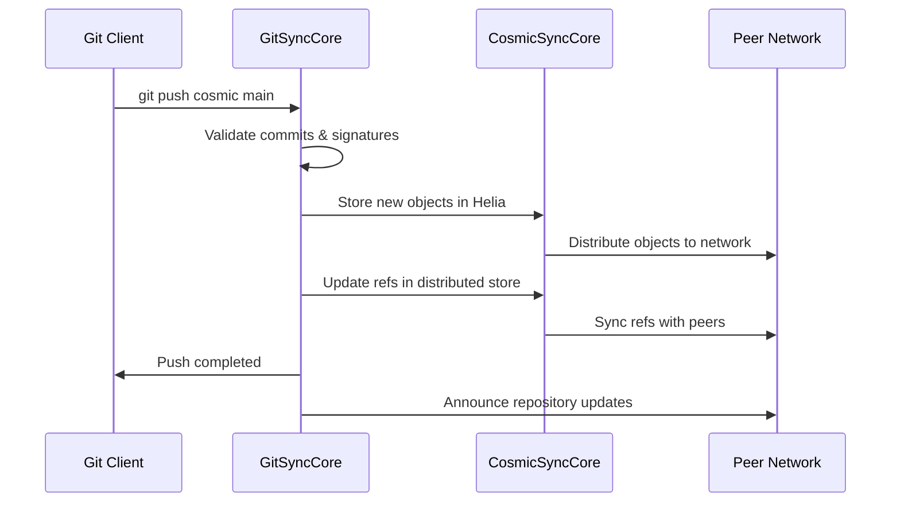
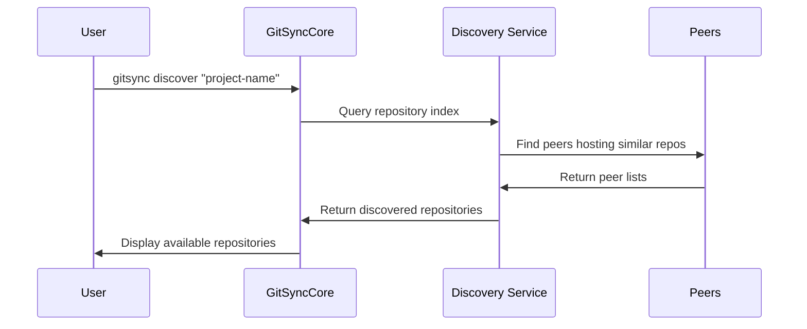

# GitSyncCore Architecture

## System Overview

GitSyncCore extends CosmicSyncCore's decentralized platform to provide Git repository hosting as a native application. This document explains how GitSyncCore components integrate with and leverage the CosmicSyncCore infrastructure.

## High-Level Architecture

```
┌─────────────────┐    ┌──────────────────┐    ┌─────────────────┐
│   Git Client    │    │   GitSyncCore    │    │  CosmicSyncCore │
│                 │    │    Application   │    │    Platform     │
├─────────────────┤    ├──────────────────┤    ├─────────────────┤
│ Standard Git    │◄──►│ Git Protocol     │◄──►│ P2P Networking  │
│ CLI/GUI         │    │ Adapter          │    │ libp2p Node     │
│                 │    │                  │    │                 │
│ git push/pull   │    │ Repository       │    │ Distributed     │
│                 │    │ Manager          │    │ Storage (Helia) │
│                 │    │                  │    │                 │
│                 │    │ Sync Engine      │◄──►│ Data Sync       │
│                 │    │                  │    │ Manager         │
│                 │    │ Security Layer   │    │ Crypto Manager  │
└─────────────────┘    └──────────────────┘    └─────────────────┘
         │                         │                       │
         │                         │                       │
         └─────────────────────────┼───────────────────────┘
                                   │
                         ┌─────────┴─────────┐
                         │  P2P Network      │
                         │  (All Peers)      │
                         └───────────────────┘
```

## Component Integration

### 1. Leveraging CosmicSyncCore P2P Networking

```javascript
// GitSyncCore reuses the existing libp2p node
class GitSyncNetwork {
  constructor() {
    this.node = CosmicSyncCore.getP2PNode();
    this.setupGitProtocols();
  }
  
  async setupGitProtocols() {
    // Register custom Git protocol handlers
    await this.node.handle('/git-sync/1.0.0', this.handleGitSync);
    await this.node.handle('/git-upload-pack/1.0.0', this.handleUploadPack);
    await this.node.handle('/git-receive-pack/1.0.0', this.handleReceivePack);
  }
  
  async discoverRepoPeers(repoId) {
    // Use CosmicSyncCore's peer discovery with Git-specific filters
    const peers = await CosmicSyncCore.discovery.findProviders(repoId);
    return peers.filter(peer => peer.protocols.includes('/git-sync/1.0.0'));
  }
}
```

### 2. Distributed Storage Integration

```javascript
class GitObjectStore {
  constructor() {
    this.helia = CosmicSyncCore.getHeliaAdapter();
    this.cache = CosmicSyncCore.getCacheManager();
  }
  
  async storeGitObject(object) {
    const cid = await this.helia.store({
      data: object.content,
      metadata: {
        type: object.type,
        size: object.size,
        gitHash: object.hash
      }
    });
    
    // Cache locally for performance
    await this.cache.set(`git-object:${object.hash}`, object);
    return cid;
  }
  
  async retrieveGitObject(hash) {
    // Try cache first
    const cached = await this.cache.get(`git-object:${hash}`);
    if (cached) return cached;
    
    // Fall back to distributed storage
    return await this.helia.retrieveByMetadata({ gitHash: hash });
  }
}
```

### 3. Data Synchronization Engine

```javascript
class GitSyncEngine {
  constructor() {
    this.syncManager = CosmicSyncCore.getSyncManager();
    this.eventBus = CosmicSyncCore.getEventBus();
  }
  
  async syncRepository(repoId, options = {}) {
    // Use CosmicSyncCore's sync with Git-specific conflict resolution
    const result = await this.syncManager.sync(
      `git-repo:${repoId}`,
      {
        conflictResolver: this.gitConflictResolver,
        strategy: options.strategy || 'optimistic'
      }
    );
    
    // Emit sync events for UI updates
    this.eventBus.emit('git-sync:completed', { repoId, result });
    return result;
  }
  
  gitConflictResolver(local, remote) {
    // Git-specific conflict resolution logic
    if (local.type === 'ref' && remote.type === 'ref') {
      return this.resolveRefConflict(local, remote);
    }
    return this.defaultCRDTMerge(local, remote);
  }
}
```

## Data Flow Examples

### 1. Git Push Operation



### 2. Repository Discovery



## Repository Data Model

### Repository Manifest
```javascript
{
  repoId: "cosmic://zb2rhYDNyB5KedWkNvW3UQzFpLvYqGNJ8J6X7oXp7yK8nLgM",
  name: "project-name",
  description: "A decentralized project",
  created: "2024-11-19T22:10:00Z",
  owner: "did:key:z6MkhaXg...",
  permissions: {
    read: ["*"], // Public read
    write: ["did:key:z6MkhaXg..."], // Only owner can write
    admin: ["did:key:z6MkhaXg..."]
  },
  branches: {
    "main": "abc123...",
    "develop": "def456..."
  },
  peers: [
    "12D3KooW...",
    "12D3KooX..."
  ]
}
```

### Git Object Storage
```javascript
// Objects stored in Helia with Git metadata
{
  cid: "bafybeigdyr...",
  data: <git-object-bytes>,
  metadata: {
    gitType: "commit|tree|blob|tag",
    gitHash: "abc123...",
    size: 1024,
    links: ["parent-cid-1", "parent-cid-2"]
  }
}
```

## Security Architecture

### Identity and Access Management
```javascript
class GitSecurity {
  constructor() {
    this.crypto = CosmicSyncCore.getCryptoManager();
    this.auth = CosmicSyncCore.getAuthManager();
  }
  
  async verifyCommitSignature(commit, publicKey) {
    return await this.crypto.verifySignature(
      commit.content,
      commit.signature,
      publicKey
    );
  }
  
  async checkRepositoryAccess(repoId, action) {
    const repo = await this.getRepoManifest(repoId);
    const userDid = await this.auth.getCurrentUser();
    
    return repo.permissions[action].includes(userDid) ||
           repo.permissions[action].includes('*');
  }
}
```

## Performance Optimizations

### Caching Strategy
```javascript
class GitPerformance {
  constructor() {
    this.cache = CosmicSyncCore.getCacheManager();
    this.setupCaching();
  }
  
  setupCaching() {
    // Cache frequently accessed objects
    this.cache.registerStrategy('git-objects', {
      maxSize: '100MB',
      ttl: 3600000, // 1 hour
      evictionPolicy: 'lru'
    });
    
    // Cache repository manifests
    this.cache.registerStrategy('repo-manifests', {
      maxSize: '10MB',
      ttl: 300000, // 5 minutes
      evictionPolicy: 'lru'
    });
  }
}
```

### Delta Transfers
```javascript
class GitDeltaEngine {
  async calculateDelta(localRef, remoteRef) {
    // Use CosmicSyncCore's diffing for efficient transfers
    return await CosmicSyncCore.diff.calculateDelta(
      localRef.objects,
      remoteRef.objects
    );
  }
}
```

## Monitoring and Metrics

### Integration with CosmicSyncCore Monitoring
```javascript
class GitMetrics {
  constructor() {
    this.monitoring = CosmicSyncCore.getMonitoring();
    this.setupMetrics();
  }
  
  setupMetrics() {
    this.monitoring.registerCounter('gitsync_operations_total', {
      help: 'Total GitSync operations',
      labels: ['operation', 'repo_id']
    });
    
    this.monitoring.registerHistogram('gitsync_operation_duration_seconds', {
      help: 'GitSync operation duration',
      labels: ['operation']
    });
  }
}
```

## Deployment Scenarios

### 1. Standalone Application
```
GitSyncCore as a separate service
↳ Uses CosmicSyncCore as a library
↳ Full Git protocol support
↳ Ideal for individual developers
```

### 2. Integrated Module
```
CosmicSyncCore with built-in GitSync
↳ Git functionality available out-of-the-box
↳ Shared resource management
↳ Ideal for application platforms
```

### 3. Hybrid Deployment
```
Mix of standalone and integrated
↳ Some peers run full GitSyncCore
↳ Others use lightweight clients
↳ Maximum network flexibility
```

## Extension Points

### Plugin System
```javascript
// Custom Git hooks and workflows
CosmicSyncCore.plugins.register('gitsync-pre-push', {
  execute: async (repoId, changes) => {
    // Custom validation logic
    return { allowed: true, reason: '' };
  }
});
```

### Custom Protocols
```javascript
// Extend with additional Git features
CosmicSyncCore.protocols.register('/git-sync/large-files/1.0.0', {
  handle: this.handleLargeFileTransfer
});
```

---

*This architecture demonstrates how GitSyncCore leverages CosmicSyncCore's robust foundation while adding Git-specific capabilities for a truly decentralized version control system.*

